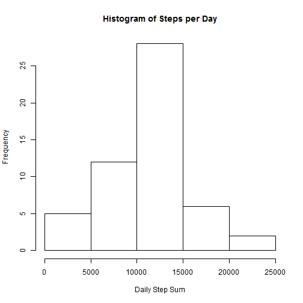
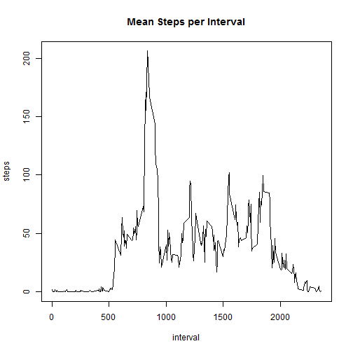
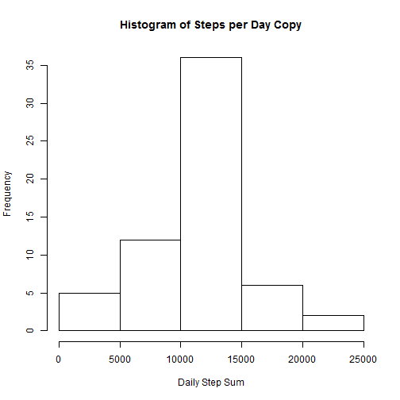
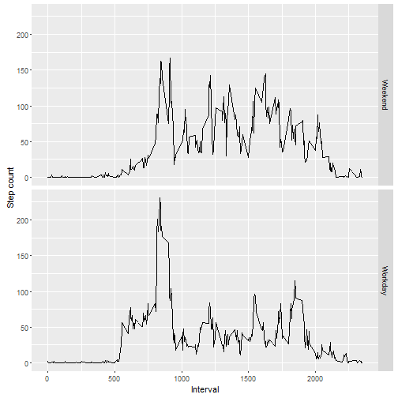

Reproducible Research: Peer Assessment 1
========================================
by Paul Jacobs


## Loading and preprocessing the data

```r
  print ("Unzip and read file")
```

```
## [1] "Unzip and read file"
```

```r
  unzip(zipfile="activity.zip")
  stepData <- read.csv("activity.csv")
```

## What is the mean total number of steps taken per day?

Summarize the total number of steps by combining the intervals per day and then produce a distribution of the daily count.s


```r
  dailySteps <- tapply(stepData$steps,stepData$date,sum)

  # png(filename="Figure\\Histogram.png")
  hist(dailySteps, 
       main = paste("Histogram of Steps per Day"), xlab="Daily Step Sum")
```



```r
  # dev.off()
  mean(dailySteps, na.rm=TRUE)
```

```
## [1] 10766.19
```

```r
  median(dailySteps, na.rm=TRUE)
```

```
## [1] 10765
```

## What is the average daily activity pattern?

The data has a series of intervals so plot the mean across the intervals to find out when the most steps are taken (on average) each day.
  

```r
  meanStepsPerInterval <- aggregate(steps ~ interval, data=stepData, FUN=mean)
  
  # png(filename="Figure\\MeanPerInterval.png")
  plot(meanStepsPerInterval, type="l", main="Mean Steps per Interval")
```



```r
  # dev.off()
  
  indexOfIntervalWithHighestMean <- which.max(meanStepsPerInterval$steps)
  intervalWithHighestMean <- meanStepsPerInterval$interval[indexOfIntervalWithHighestMean]
```


## Imputing missing values  

There are missing values in the data, impute values for them.  The strategy is to take the prior means per interval and use that data for any intervals that don't have an actual value.


```r
  stepDataCopy <- stepData
  
  replaceWithMean <- function(steps, interval) {
    if (!is.na(steps))
      newMean <- c(steps)
    else
      newMean <- (meanStepsPerInterval[meanStepsPerInterval$interval==interval, "steps"])
    return(newMean)
  }
  
  stepDataCopy$steps <- mapply(replaceWithMean, stepDataCopy$steps, stepDataCopy$interval)
  
  dailyStepsCopy <- tapply(stepDataCopy$steps,stepDataCopy$date,sum)
  
  # png(filename="Figure\\HistWithAddedData.png")
  hist(dailyStepsCopy, 
       main = paste("Histogram of Steps per Day Copy"), xlab="Daily Step Sum")
```



```r
  # dev.off()
  mean(dailyStepsCopy, na.rm=TRUE)
```

```
## [1] 10766.19
```

```r
  median(dailyStepsCopy, na.rm=TRUE)
```

```
## [1] 10766.19
```

## Are there differences in activity patterns between weekdays and weekends?

Create a function that separates work days from the week end and build a new data set that adds the workday/weekend distinction.  Follow that with a plot to analyze the differences.


```r
calcWeekendOrWeekday <- function(date) {
    day <- weekdays(date)
    if (day %in% c("Monday", "Tuesday", "Wednesday", "Thursday", "Friday"))
      return("Workday")
    else if (day %in% c("Saturday", "Sunday"))
      return("Weekend")
    else
      stop("invalid date")
  }
  stepDataCopy$date <- as.Date(stepDataCopy$date)
  stepDataCopy$day <- sapply(stepDataCopy$date, FUN=calcWeekendOrWeekday)
  
  library(ggplot2)
  
  dayTypeAverage <- aggregate(steps ~ interval + day, data=stepDataCopy, mean)
  
  # png(filename="Figure\\WeekdayWeekendComparison.png")
  ggplot(dayTypeAverage, aes(interval, steps)) + 
    xlab("Interval") + 
    facet_grid(day ~ .) +
    geom_line() + 
    ylab("Step count")
```



```r
  # dev.off()
```

